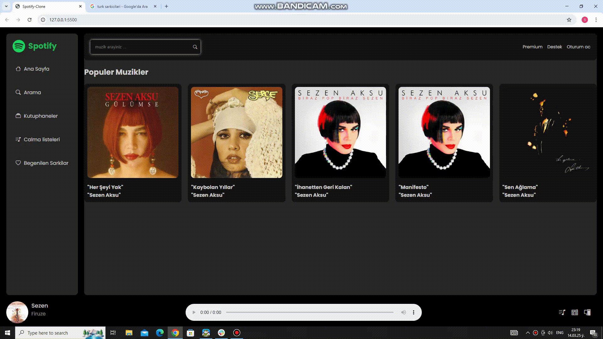

# Spotify Projesi

Bu proje, Spotify'ın temel özelliklerini taklit eden bir web uygulamasıdır. Projede **SCSS** ve **JavaScript modüler yapı** kullanılarak modern web geliştirme teknikleri uygulanmıştır. Ayrıca, tüm resimler ve şarkı bilgileri bir API'dan dinamik olarak alınarak sayfa üzerinde gösterilmektedir.

## Özellikler

- **Responsive Tasarım:** Farklı ekran boyutlarına uyumlu, kullanıcı dostu bir arayüz.
- **SCSS Kullanımı:** Temiz ve modüler CSS yapısı için SCSS kullanıldı.
- **JavaScript Modüler Yapı:** Kodun daha organize ve bakımı kolay olması için JavaScript modüler yapıda yazıldı.
- **Dinamik İçerik:** Tüm resimler ve şarkı bilgileri bir API'dan alınarak dinamik olarak sayfaya yüklenir.
- **API Entegrasyonu:** Şarkı bilgileri ve resimler API üzerinden çekilerek güncel içerik sağlanır.

Kisa tanitimi:

